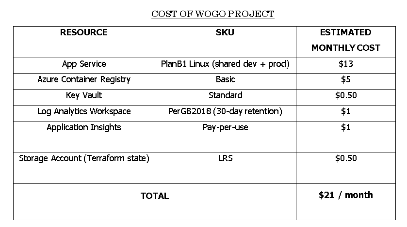
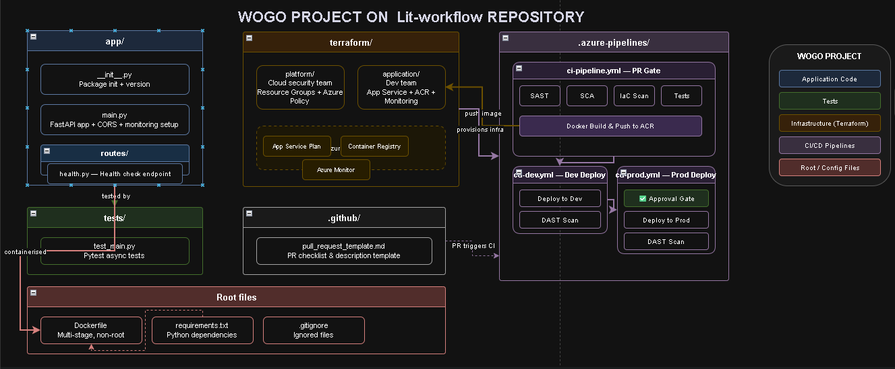
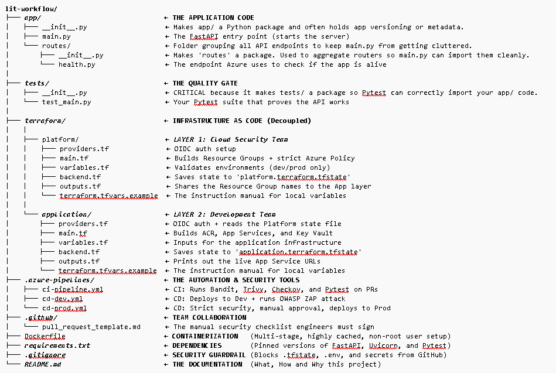

# WOGO Enterprise DevSecOps Pipeline

**Project Goal:** A production-grade DevOps infrastructure pipeline for a Python FastAPI application on Azure strictly following this workflow:

**Code > GitHub > PR > Merge > Azure Pipelines > Dev > PR > Merge > Azure Pipelines > Live on Production.**

Terraform creates the base infrastructure to host the application. It's not used in the code push.

This project follows strict separation of duties, Zero-Trust OIDC authentication, and a 4-stage automated security scans.

**(A 5-minutes read, walk with me. Let's go!)**


### Prerequisites:

Install these before anything else:

1. Visual Studio Code (Code editor)  
2. Git (for Version control) 
3. Azure CLI (to talk to Azure from terminal)  
4. Terraform (to create cloud infrastructure)
5. Docker Desktop  (Build and test containers locally)
6. Python 3.11+ (to run the FastAPI app locally)


**Using the VS Code, verify everything works:**
```bash
git --version
az --version
terraform --version
docker --version
python --version
```


### **Before touching a single file or code on VS Code, understand the full journey:**

You write code in your VS Code Editor

       ↓

Push to your feature branch on GitHub

       ↓

Open Pull Request → dev branch

       ↓

Azure Pipeline no.1 triggers: Runs Bandit + Trivy + Checkov + Build

       ↓

PR is reviewed & merged to dev

       ↓

Azure Pipeline no.2 triggers: Deploys to DEV environment + Runs OWASP ZAP

       ↓

QA passes → Open Pull Request: dev → main

       ↓

Azure Pipeline no.3 triggers: Same security checks again + explicit manual approval checks

       ↓

PR merged to main upon a manual approval granted

       ↓

Azure Pipeline no.4 triggers: Deploys to PRODUCTION and your application is now live and secured.


### The Tech Stack & DevSecOps Tools:
* **App:** Python, FastAPI, Uvicorn.
* **Containerization:** Docker (multi-stage, non-root build).
* **Infrastructure-as-Code:** Terraform (Decoupled Platform & Application layers).
* **Authentication:** OIDC Workload Identity Federation (no stored secrets). 
* **Cloud:**  Azure Student account, southafricanorth region, Azure App Service (Linux), Azure Container Registry.
* **CI/CD:** Azure Pipelines / Azure DevOps.
* **Azure-native Monitoring & Observability Tools:** Azure Application Insights, Azure Monitor Alerts (The Pager) & Log Analytics visually monitoring your app's metrics and performances on a dashboard.
* **Security Scanners:**
  - **Bandit (SAST):** Scans Python code for hardcoded secrets and vulnerabilities.
  - **Trivy (SCA):** Scans dependencies and Docker images for known CVEs.
  - **Checkov (IaC):** Scans Terraform for cloud misconfigurations (open storage account, missing encryption).
  - **OWASP ZAP (DAST):** Attacks the live deployed application to test for runtime exploits (injection, auth bypass, XSS, ect).


### Cloud Budget:

Before you spin up anything on the cloud, analyze the financial implication associated with each resource or service first.



### Architectural Diagram:

This project is named **WOGO** and was built in the **lit-workflow** directory containing the Application codes, Test code, Root/Config files, Terraform, Azure pipelines.






### Architecture & Pipeline Flow:

WOGO project follows a strict DevOps culture.

1. Infrastructure is provisioned once with Terraform. 

2. Push to GitHub feature/branch. All application updates happen automatically via Azure Pipelines.

3. **Pull Request (Feature → Dev):** Triggers `ci-pipeline.yml`. Runs Bandit, Trivy, Checkov, Pytest, and builds the Docker image. *Must pass to merge.*

4. **CD Dev (Merge to Dev):** Triggers `cd-dev.yml` and deploys to the Dev App Service and runs an OWASP ZAP attack against the live dev environment. 

5. **CD Prod (Merge to Main):** Triggers `cd-prod.yml`and runs strict security gates (fails on HIGH), builds the prod image, waits for **Manual Approval** within 1 hour, deploys to Prod, and runs a final ZAP verification.


### **Branch Strategy:**

main    → production (protected, requires PR + approval)

dev     → staging (protected, requires PR + status checks)

feature → where all work happens (temporary, deleted after merge)


**The security scanners are stricter in production than in dev. A HIGH-severity finding that is reported in dev will block a production deployment entirely.*


### Environment URLs:

**Development:** `https://wogo-dev-app-XXXX.azurewebsites.net` triggers merge to dev

**Production:** `https://wogo-prod-app-XXXX.azurewebsites.net` triggers merge to main + manual approval.

**Monitoring Dashboard:** Azure Portal → Application Insights → wogo-appinsights triggers is always on.


### INFRASTRUCTURE SETUP VIA TERRAFORM:

1. **Authenticate to Azure**

`az login`

2. **Platform Layer** (creates Resource Groups & Azure Policy)

`cd terraform/platform`

`cp terraform.tfvars.example terraform.tfvars`   **# Make sure to put your own Sub ID.**

`terraform init && terraform apply`

3. **Application Layer** (creates ACR, App Service, Key Vault, Monitoring)

`cd terraform/application`

`cp terraform.tfvars.example terraform.tfvars`  **# Make sure to put your own Sub ID.**

`terraform init && terraform apply`

That's it. End of infrastructure creation with Terraform.


### AZURE DEVOPS SETUP:

To connect your new infrastructure to become automated pipelines, do these:

**1. Service Connections:** Create an Azure Resource Manager connection using Workload Identity Federation (OIDC) (no secrets stored!) named azure-wogo-sc.

**2. Variable Group:** Create a library group named wogo-global-vars containing your Terraform outputs (e.g., DEV_APP_URL, ACR_NAME, DEV_RESOURCE_GROUP).

**3. Run Pipelines:** Import the 3 YAML files from .azure-pipelines/ and run them.

EASY. THAT'S ALL.


**Note:** **No one commits directly to main or dev. All changes flow through Pull Requests.*


### API Endpoints:

`GET /` - API Status (Root confirms the API is running)

`GET /api/v1/health`  (Health check used by Azure and OWASP ZAP)

`GET /docs` (Interactive Swagger UI)

`GET /openAPI.json` (OpenAPI schema consumed by OWASP ZAP for DAST)


### Monitoring and Observability:

Azure Application Insights connects to both App Services automatically via an environment variable injected by Terraform. Once traffic hits the app, the dashboard shows:

- Live requests per second and response times per endpoint
- Failed requests and full exception stack traces.
- Uptime percentage over time and full searchable log history.

An Azure Monitor alert sends an email notification if production returns more than 5 HTTP 500 errors within 5 minutes which is the foundation of 99% uptime management.


### Open ID Connect (OIDC) - Zero-Trust Authentication:

No client secrets are stored anywhere. Azure Pipelines uses Workload Identity Federation to prove its own identity to Azure and receive a short-lived token on every pipeline run. The Service Principal identity exists while the password does not.


### Local development on your machine:
```bash
# Clone and setup virtual environment
git clone [https://github.com/YOUR_USERNAME/lit-workflow.git](https://github.com/YOUR_USERNAME/lit-workflow.git)
cd lit-workflow
python -m venv venv && source venv/bin/activate
pip install -r requirements.txt

# Run the API locally
uvicorn app.main:app --reload --port 8000
# Visit http://localhost:8000/docs

# Run tests 
pytest tests/ -v 

# Run security scans locally 
bandit -r app/ --severity-level medium 
checkov --directory terraform/ --framework terraform
```


That's a big win, CONGRATULATIONS!


### To destroy everything once you've successfully completed on the cloud:

1. Delete the application layer first.

`cd terraform/application`

`terraform destroy -var="environment=dev"`

2. Delete the platform layer.

`cd ../platform`

`terraform destroy -var="environment=dev"`


3. Delete the Backend State File Storage (Optionl)

`az group delete --name wogo-tfstate-rg --yes --no-wait`


### To prevent cloud cost billing if you do not wish to destroy your infrastructure, stop the Azure App Services on both environments:

1. Stop the FastAPI container from running so the website do not load any Application Insights telemetry from being sent.

`az webapp stop --name wogo-dev-app-XXXX --resource-group wogo-dev-rg`


2.  Alternatively, scale down on the Azure portal.

Go to App Service Plan (wogo-dev-asp)  → click Scale up (App Service plan) on the left menu  → change the pricing tier from B1 to F1 (Free) and finally, click Apply.


## KEY TAKEAWAYS:

**If you're using an Azure Student account, there are limitations to what you can do and access.**

You'd likely face some restrictions on role assignments (Resource Policy Contributor role) of the Azure Policy deny guardrail for PostgreSQL and ACRPull permissions for both App Services at the subscription scope. 

**Solution:** Manually assign it or do so via Azure portal.

**In a Pay-As-You-Go subscription account, there are no limitations.**


